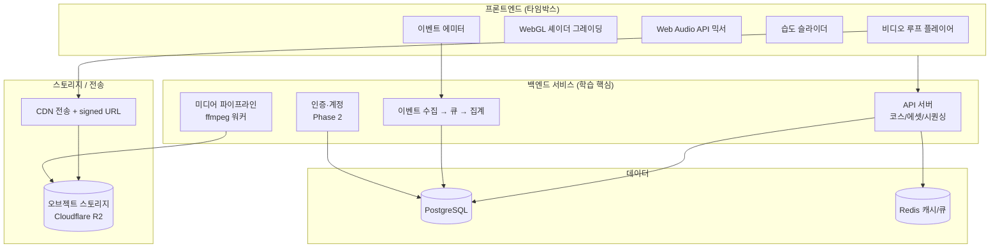

# Petrichor — 기술 설계 & 로드맵

| 항목 | 내용 |
|---|---|
| **문서 목적** | (A) 기술 설계 (B) 백엔드 학습 중심 로드맵 |
| **작성일** | 2026-06-21 |
| **상태** | 초안 v0.1 |
| **핵심 제약** | 작성자는 **백엔드 주니어**. 이 프로젝트를 *백엔드 역량 습작*으로 쓰되, 프론트엔드에 시간을 빼앗기지 않게 **타임박스**한다. |

> ⚠️ **학습 관점의 핵심 경고**
> 이 제품의 '어려운 공학'은 기본적으로 **프론트엔드(WebGL·Web Audio)**에 몰려 있다. 아무 설계 없이 만들면 "예쁜 사이트 + 얇은 CRUD 백엔드"로 끝나 백엔드 학습 가치가 거의 없다(3/10).
> 따라서 본 문서는 **백엔드 깊이를 의도적으로 설계**한다: 미디어 파이프라인 · 계정 · 분석 파이프라인 · 시퀀싱 서비스 · 배포/관측성. 이 깊이가 들어가야 학습 가치가 7/10로 올라간다.

---

# Part A. 기술 설계

## A-1. 아키텍처 개요



원칙: **프론트는 렌더링/재생만, '판단'은 서버에.** 코스 조합·시퀀싱·시간대 로직을 서버에 두어 백엔드에 실제 로직을 확보한다(정적 설정 서버화 방지).

## A-2. 핵심 기술 결정과 제약

| 결정 | 이유 / 제약 |
|---|---|
| **영상 자체 호스팅(짧은 루프)** | 크로스오리진 유튜브 iframe은 canvas/WebGL로 픽셀 접근 불가(CORS taint) → 셰이더 그레이딩 불가. 자체 호스팅(`<video crossorigin="anonymous">` + CDN의 `Access-Control-Allow-Origin`)이어야 셰이더 처리 가능 |
| **그레이딩은 WebGL 셰이더** | CSS 필터로는 4K→2000년대 질감 전환 불가. 그레인/색수차/다운스케일은 프래그먼트 셰이더로 |
| **오디오는 Web Audio API** | 레이어별 `GainNode`, 리버브는 `ConvolverNode`(wet/dry). 습도 슬라이더가 게인·wet 비율을 동시 제어 |
| **심리스 루프** | 영상은 편집 단계에서 심리스로 제작하거나, 2버퍼 크로스페이드로 이음매 제거 |

## A-3. 프론트엔드 (타임박스: '충분히 괜찮은' 선)

- 스택: **Vite + TypeScript**, WebGL은 경량 라이브러리(`ogl`/`regl`) 또는 직접 셰이더, 오디오는 Web Audio API 직접.
- 컴포넌트: 풀스크린 비디오, 셰이더 패스, 오디오 그래프, 습도 슬라이더, 이벤트 에미터(heartbeat 30s).
- **습도 슬라이더 매핑(예시)**

```ts
// humidity ∈ [0,1] → 여러 파라미터를 곡선으로 동시 제어
function applyHumidity(h: number) {
  audio.rainGain.gain.value      = lerp(0.1, 1.0, h);     // 빗소리 ↑
  audio.reverbWet.gain.value     = lerp(0.0, 0.6, h);     // 리버브 wet ↑
  shader.uniforms.uCyanTint      = lerp(0.05, 0.4, h);    // 시안 틴트 ↑
  shader.uniforms.uGrain         = lerp(0.2, 0.7, h);     // 그레인 ↑
}
```

## A-4. 백엔드 서비스 (← 학습의 핵심)

> 추천 스택(결정적으로 하나 제시, 자유 교체 가능): **NestJS(TypeScript) + PostgreSQL(Prisma) + Redis + BullMQ(큐/워커) + ffmpeg + Cloudflare R2 + CDN.**
> 대안: FastAPI(Python)+Celery, Go(net/http)+asynq 등 — 어느 것이든 아래 '깊이 항목'을 구현하는 게 핵심.

| 서비스 | 학습하는 역량 | 우선순위 |
|---|---|---|
| **미디어 파이프라인** ⭐ | 업로드 원본 → ffmpeg 트랜스코딩(H.264/VP9, 포스터/멀티해상도) → R2 저장 → CDN 서빙 + signed URL. 큐(BullMQ) + 워커 패턴. **흔한 CRUD엔 없는 시스템 경험** | Phase 2 |
| **에셋/코스/시퀀싱 API** | 재사용 에셋 조합, 시간대·무드 가중 랜덤 = **서버 로직**. REST 설계·페이지네이션·캐싱(Redis) | Phase 1~2 |
| **인증·계정** | JWT/세션, 즐겨찾기 코스·습도 프리셋 저장. 주니어 필수템 | Phase 2 |
| **이벤트/분석 파이프라인** | `session_start`·`course_play`·`slider_change`·heartbeat 수집 → 큐 → 집계(리텐션·세션길이). **제품 지표 + 데이터 파이프라인 동시 학습** | Phase 2 |
| **운영(관측성/배포)** | Docker, CI/CD, 헬스체크, 구조적 로깅, 레이트리밋 | Phase 1~3 |

## A-5. 데이터 모델

```sql
-- 영상/음악/환경음을 재사용 에셋으로 분리 (+ 라이선스 추적)
CREATE TABLE assets (
    id          SERIAL PRIMARY KEY,
    kind        VARCHAR(20),   -- 'video_loop' | 'music' | 'ambient'
    storage_url TEXT,
    loop_in_ms  INT,
    loop_out_ms INT,
    license     VARCHAR(50),   -- 'original' | 'cc-by' | 'suno-pro' ...  ← 합법성 추적
    source_note TEXT,
    created_at  TIMESTAMPTZ DEFAULT now()
);

CREATE TABLE courses (
    id           SERIAL PRIMARY KEY,
    region       VARCHAR(50),
    title        VARCHAR(100),
    mood_tags    TEXT[],       -- ['rain','2am','post-rain']
    grade_config JSONB         -- 셰이더 파라미터(CSS 아님): {"grain":0.4,"cyan":0.3,"bloom":0.2,"downscale":0.5}
);

-- 코스 = 에셋 조합 + 기본 게인 + 습도 곡선
CREATE TABLE course_assets (
    course_id      INT REFERENCES courses(id),
    asset_id       INT REFERENCES assets(id),
    base_gain      REAL,
    humidity_curve JSONB,      -- 습도 슬라이더가 이 에셋을 어떻게 움직이는지
    PRIMARY KEY (course_id, asset_id)
);

-- Phase 2: 계정 / 분석
CREATE TABLE users (
    id         SERIAL PRIMARY KEY,
    email      TEXT UNIQUE,
    created_at TIMESTAMPTZ DEFAULT now()
);

CREATE TABLE events (
    id          BIGSERIAL PRIMARY KEY,
    anon_id     UUID,          -- 비로그인 추적
    user_id     INT NULL REFERENCES users(id),
    type        VARCHAR(30),   -- session_start | course_play | slider_change | heartbeat
    course_id   INT NULL,
    payload     JSONB,
    created_at  TIMESTAMPTZ DEFAULT now()
);
```

## A-6. 인프라 / 외부 의존성
- **스토리지/전송:** Cloudflare R2(egress 무료) 또는 Bunny + CDN. 보호 에셋은 signed URL.
- **배포:** Docker 컨테이너, 단일 VPS 또는 Fly.io/Render. CI/CD(GitHub Actions).
- **외부 API:** AI 오디오 생성(Suno/Udio 상업 티어) — 라이선스/IP 범위 확인 후 사용. 영상은 직접 촬영/라이선스/AI 생성.

---

# Part B. 로드맵

> 운영 원칙
> 1. **프론트는 타임박스.** 각 Phase에서 프론트 작업 시간을 정해두고 초과하면 '충분히 괜찮은' 선에서 멈춘다.
> 2. **백엔드 깊이를 매 Phase 산출물로 못 박는다.**
> 3. MVP는 **무드 1개**로 좁힌다(PRD §5).

## Phase 0 — 셋업 (3~4일)
- 목표: 레포·CI·Docker·DB 마이그레이션 스캐폴딩.
- 백엔드 마일스톤: NestJS + Prisma + Postgres 기동, `/health`, GitHub Actions 린트/빌드.
- 산출물: 빈 껍데기지만 **배포까지 한 번 통과**(staging URL).
- 완료 기준: 커밋 → CI 통과 → staging 배포 그린.

## Phase 1 — MVP: 무드 1개 (2~3주)
- 목표: 로그인 없이 무드 1개가 완성도 있게 재생.
- 프론트(타임박스): 풀스크린 루프 재생 + WebGL 그레이딩 + 오디오 2레이어 + 습도 슬라이더.
- 백엔드 마일스톤:
  - 에셋/코스/`course_assets` CRUD + 조회 API(페이지네이션, Redis 캐싱)
  - **시퀀싱 엔드포인트**: 코스 1개를 에셋 조합으로 서버에서 구성해 반환(정적 JSON 금지)
  - 레이트리밋·구조적 로깅
- 산출물: 동작하는 단일 무드 + 서버 구성 API.
- 완료 기준: 첫 세션 10분 체류가 관찰될 만큼 '머물고 싶은' 완성도(PRD 지표 §4).

## Phase 2 — 백엔드 깊이 (3~4주) ⭐ 학습의 본체
- 목표: 백엔드 포트폴리오로서의 가치 확보.
- 백엔드 마일스톤:
  1. **미디어 파이프라인**: 원본 업로드 → BullMQ 큐 → ffmpeg 워커 트랜스코딩 → R2 업로드 → CDN signed URL. (재시도·실패 처리 포함)
  2. **인증·계정**: JWT, 즐겨찾기 코스·습도 프리셋 저장/복원.
  3. **이벤트/분석 파이프라인**: 수집 엔드포인트 → 큐 → 집계 잡(리텐션·세션길이·슬라이더 사용률) → 간단 대시보드/쿼리.
- 산출물: 업로드→배포 자동화된 미디어 처리 + 계정 + 지표 집계.
- 완료 기준: 새 영상 1개를 **업로드만 하면** 트랜스코딩·배포가 끝까지 자동.

## Phase 3 — 확장 & 마감 (2~3주, 선택)
- 목표: 무드 2~3개로 확장 + 추천/시퀀싱 고도화 + 운영 관측성.
- 백엔드 마일스톤: 시간대/무드 기반 추천, 캐시 전략 정교화, 메트릭/트레이싱(관측성), 부하 점검.
- 산출물: 다무드 + 추천 + 모니터링.
- 완료 기준: 운영 지표를 보고 의사결정할 수 있는 상태.

## 단계별 요약

| Phase | 기간(목표) | 백엔드 핵심 산출물 | 학습 가치 |
|---|---|---|---|
| 0 셋업 | 3~4일 | CI/CD·배포 파이프라인 | 운영 기초 |
| 1 MVP | 2~3주 | 시퀀싱 API·캐싱·레이트리밋 | API 설계 |
| 2 깊이 | 3~4주 | 미디어 파이프라인·인증·분석 | **시스템 설계(핵심)** |
| 3 확장 | 2~3주 | 추천·관측성 | 고도화 |

---

## 이력서 한 줄 (역산 스펙)
> "ffmpeg 기반 **미디어 트랜스코딩 파이프라인**(큐/워커)과 **오브젝트 스토리지·CDN signed URL 서빙**, **이벤트 수집·집계 분석 파이프라인**, JWT 인증을 갖춘 앰비언트 웹 서비스 백엔드를 설계·구현 (NestJS/PostgreSQL/Redis/R2)."

이 한 줄이 나오게 Phase 2를 반드시 완주한다. (흔한 CRUD/To-Do API와 차별화되는 지점이 전부 Phase 2에 있다.)

## 타임박스 재확인
- 프론트(WebGL/오디오)는 **무한히 예뻐질 수 있는 함정**이다. 각 Phase의 프론트 시간을 미리 정하고, 초과 시 백엔드 깊이 항목으로 강제 전환한다.
- "예쁜 사이트 + 얇은 백엔드"는 이 프로젝트의 **실패 정의**다.
